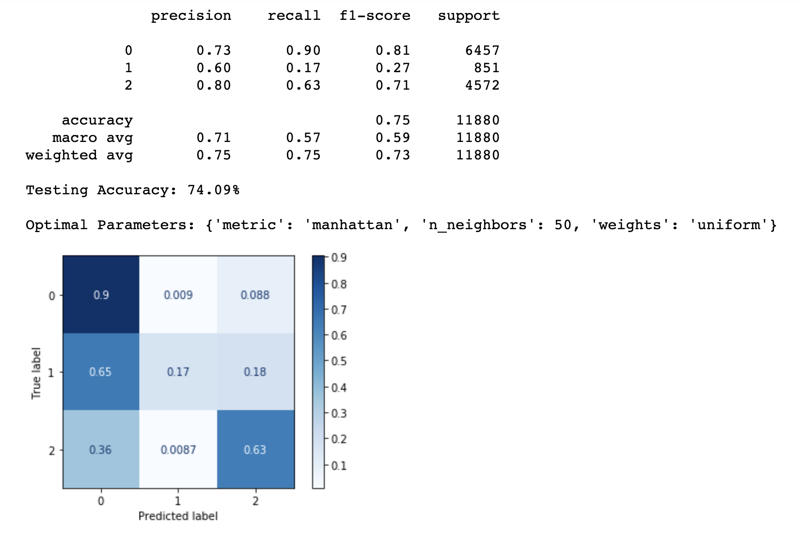

# Tanzania's Water Quality Analysis and Predictive Models Report

by Nadir Sarigul


## I. Overview and Goals

This report contains a detailed explanation of the extraction, cleaning, analysis and generation of prediction models for the state of waterpoints in Tanzania. This report is based off of data collected from the Taarifa and the Tanzanian Ministry of Water as part of the "Pump it Up: Data Mining the Water Table" competition. The ultimate goal of this analysis is to predict which waterpoints will fail so that we can improve maintenance operations and ensure that clean, potable water is avaialble across Tanzania. 

To be able to understand the waterpoint conditions and functionality better, I divided this analysis in five questions:

1) Does geographical location affect functionality of the waterpoints?

2) Does the source of the water contribute for the functionality of the waterpoints?

3) Does the amount of water affect funtionality of the waterpoints?

4) Does payment type affect functionality of waterpoints?

5) Can we create a model that accuratly predicts the funtionality of a waterpoint in Tanzania?


## II. Data Understanding

The data set that will be used in this analysis/model is comprised of 2 tables:

- Training set labels: The dependent variable (status_group) for each of the rows in the training set values

- Training set values: The independent variables for the training set

This data set contains 59400 unique waterpoint entries containing information about the following features:

* amount_tsh - Total static head (amount water available to waterpoint)
* date_recorded - The date the row was entered
* funder - Who funded the well
* gps_height - Altitude of the well
* installer - Organization that installed the well
* longitude - GPS coordinate
* latitude - GPS coordinate
* wpt_name - Name of the waterpoint if there is one
* num_private -
* basin - Geographic water basin
* subvillage - Geographic location
* region - Geographic location
* region_code - Geographic location (coded)
* district_code - Geographic location (coded)
* lga - Geographic location
* ward - Geographic location
* population - Population around the well
* public_meeting - True/False
* recorded_by - Group entering this row of data
* scheme_management - Who operates the waterpoint
* scheme_name - Who operates the waterpoint
* permit - If the waterpoint is permitted
* construction_year - Year the waterpoint was constructed
* extraction_type - The kind of extraction the waterpoint uses
* extraction_type_group - The kind of extraction the waterpoint uses
* extraction_type_class - The kind of extraction the waterpoint uses
* management - How the waterpoint is managed
* management_group - How the waterpoint is managed
* payment - What the water costs
* payment_type - What the water costs
* water_quality - The quality of the water
* quality_group - The quality of the water
* quantity - The quantity of water
* quantity_group - The quantity of water
* source - The source of the water
* source_type - The source of the water
* source_class - The source of the water
* waterpoint_type - The kind of waterpoint
* waterpoint_type_group - The kind of waterpoint

There are three different status group possible for each waterpoint: "functional", "functional needs repair" and "non-functional". Here is a count of the number of waterpoints ascribed to each status:


From this graph we observe that the large majority of the waterpoints are either functional or non-functional, 31259 waterpoints and 22824 waterpoints respectively, while only a very small fraction of the waterpoints are designated as functional needs repair (4317). 


## III. Data Preparation for Exploration


### 1) Data imported
 
* training_set_values.csv

* Train_set_labels.csv

These two tables were merged to create the dataframe used in this analysis. 


### 2) Cleaning and preparation of dataset 

After looking at the general properties of the data, I decided to drop the following features:

* ID: Not relevant for this analysis
* data_recorded: Not relevant for this analysis
* wpt_name: Not relevant for this analysis
* gps_height: Redundant information about geographic location
* num_private: Not clear what this feature refers to
* subvillage: Redundant information about geographic location
* region_code: Redundant information about geographic location
* district_code: Redundant information about geographic location
* ward: Redundant information about geographic location
* public_meeting: Not clear what this feature refers to
* recorded_by: Not relevant for this analysis
* scheme_name: Redundant information about who operates the waterpoint
* extraction_type_goup: Redundant information about the kind of extraction the waterpoint uses
* extraction_type_class: Redundant information about the kind of extraction the waterpoint uses
* quality_group: Redundant information about the quality of the water
* quantity_group: Redundant information about the quantity of the water
* source_type: Redundant information about the source of the water
* waterpoint_type_group: Redundant information about the kind of waterpoint
* longitude: Only used to build a map of the localition of the waterpoints
* latitude: Only used to build a map of the localition of the waterpoints

Handling missing data:

* The feature "amount_tsh" contained 41639 "0" values. To address the lack of information in these instances I have split the data set into entries that have a value higher than "0" and entries whose value was "0". I subsequently calculated the mean of the entries with values higher than "0". I then replaced all "0" with the calculated mean value. The "population" and "contruction_year" features also had a similar issue with a large porportion of the entires containing "0" as a value. I proceeded as described for the amount_tsh to replace "0" with the mean of the data set. 

* The features "funder" and "installer" did not contain null values but had a large amount of categories which would make exploration and modeling impractical. To address this problem, for "funder" categories with lower than 1000 waterpoints and "installer" categories with lower than 500 waterpoints were moved into a new category labeled as rare. 


## IV. Data Exploration

### 1) Does geographical location affect functionality of the waterpoint?


From this analysis we can see that in absolute numbers the regions that have more total number of waterpoints (such as Iringa) are also the ones that have the most amount of non-functional waterpoints. However, because the amount of functional waterpoints in these regions are still higher than the non-functional, they are likely less problematic to the surounding populations. This trend changes as the absolute number of well starts declining, with the regions of Mwanza, Singida and Dodoma having almost the same number of funtional and non-functional waterpoints.  It becomes worse in regions where the total number of waterpoints is lower, having the majority of them non-functional which represents a bigger problem for the people living in those areas. That is the case in the Lindi and Mtwara regions where there are more non-functional waterpoints than there are functional. It is also important to note that even though the amount of waterpoints that need repair is rather low throughout, the Kigoma region has a large porportion of waterpoints that need repair. 


### 2) Does the source of the water contribute for the functionality of the waterpoint?

Another feature that may influence functionality is the source of the water in each waterpoint. 


In fact, the source of the water in each waterpoint does seem to affect the status of the waterpoint. For example waterpoints where the water comes from shallow wells or machine dbh have much higher proportions of non-functional waterpoints than waterpoints where the water comes from springs or rivers. 

### 3) Does the amount of water affect funtionality of the waterpoint?


The amount of water in each waterpoint also seems to affect the functionality of said waterpoint. Looking at the data is clear that dry waterpoints are largely non-functional, while waterpoints that have sufficient amounts of water have higher proportions of functioning wells.  


### 4) Does payment-type affect functionality of waterpoints?

Another important feature that we have to consider as a factor that may affect the status of the waterpoint is wether the water is payed for or not. 


From this exploratory analysis we can see that waterpoints that do not required any type of payment or that do not have information about payment have the highest proportion of wells that are not functional. In contrast, water points that are paid for (independently of the payment method) are generally more functional. This suggests that if the water is paid for there is a higher likelyhood that the waterpoint is better cared for.  

## V. Data Preparation for Modeling

In preparation to start modeling the data I randomly split the dataframe into data to train my models (80% of the data) and data to test my models (20% of the data).

While exploring the data I realized that the categorical features "funder", "installer", "scheme_management" and "permit"contained missing values, which would affect modeling. To address this issue, I used the Sklearn SimpleImputer to replace missing values using "most_frequent" as a strategy. This strategy replaces missing values with the most frequent category in each feature. 


## VI. Modeling


### 1) Dummy Classifier

Because developing machine learning models rely on multiple attempts to increase the success rate of classification tasks, evaluating the baseline success rate is an important step to take. We can do this using the Dummy Classifier, which sets the baseline performance (i.e. the success rate that one should expect to achive by simply guessing). 


Looking at the this model we now know that our training and test score  baseline is 0.45 and accuracy is 0.44. Looking at the confusion matrice we can see that at baseline we can predict 54% of the functional, 5.9% of the functional need repair and 38% of the non-functional waterpoints. 


### 2) Decision Tree Classifier

The Decision Tree algorithm sets a sequential, hierarchical decisions. The goal of using a Decision Tree is to create a training model that can be used to predict the class or value of the target variable by learning simple decision rules inferred from prior data. 

#### 2.1) Default Decision Tree

I started by making a decision tree with the default parameters


Looking at this model, we can see that our training (0.92) and test score (0.76), as well as the accurary (0.76), increased considerably from the baseline determined by using the Dummy Classifier. We are now able to accuratly predict 84% of the functional waterpoints. However, this model only accuratly recalls 34% of the functional need repair and 73% of the non-functional waterpoints. Moreover, the training score and the test scores are considerably far apart which tells us that this model is overfitting data.

To get a sense into what features are giving the most importance in the decision tree, I calculated the feature importance of this model. 


For this decision tree model the features that have the most importance are quantity of water (specially if it is dry), population around the waterpoint and how old the waterpoint is (construction year). 


An important feature of modeling using decision trees is the depth (lenght of the longest path from a root to a leaf) of the decision tree. This is because the deeper the tree the more difficult it becomes to understand the decision rules of a tree. Since the default decision tree model was overfitted, I tried three different depths to see if it improves the predictive power of the model.


#### 2.2) Decision Tree with Depth of 100

In this model I assigned the depth of the tree to a maximum of 100. 


Looking at this model, we can see that the training score, the test score and the accuracy are the same as the standard decision tree shown above, showing that this model is still overfitted. We can still accuratly predict 84% of the functional,and 73% of the non-functional waterpoints. However, this decision tree now can only predict 32% of the functional need repair waterpoints. So these changes did not improve the model.


#### 2.3) Decision Tree with Depth of 20

Since a depth of 100 did not improve the tree, I decided to decrease the depth to see if it would make for a better fitted model and improve my ability to predict the functionality of the waterpoints.  


This model now is a bit better fitted with a training score = 0.80 and a test score = 0.75. However, the accuracy did not improve, in fact it decreases slightly to 0.75.  Moreover, while we are now able to accuratly predict more of the functional waterpoints (91%), we can only predict 20% of the functional need repair and 63% of the non-functional waterpoints. So this model does not present itself as an improvement from the default decision tree either.  


#### 2.4) Decision Tree with Depth of 10

Finaly I decided to reduce the depth of the tree to 10 to see if it would give me a better fitted model. 


Reducing the depth of the tree did make the model better fitted (training score = 0.72, test score = 0.71) but the accuracy is reduced to 0.71. However, while the model keeps predicting 91% of the functional waterpoints as the model with the depth of 20, its ability to recall functional need repair and non-functional is reduced to 8.6% and 55%, respectively. Therefore, this model should also be improved upon in order to accuratly predict the functional status of the waterpoints. 


### 3) Random Forest Classifier

Random Forest is a tree-based  algorithm that leverages the power of multiple decision trees for making decisions. Because often a a single tree is not sufficient for producing effective results, and my decision tree models could definitly be improved, I decided to also use the Random Forest algorithm to see if it would improve the predictive power of the model. 


#### 3.1) Default Random Forest (with 100 estimators)

As with the decision tree, I started by making a random forest model with the default parameters.


The default random forest model is a little better than the decision tree models I made, albeit still overfitted. The training score for this model is 0.92 and the test score is 0.79 with an accuracy of 0.79. Looking at the confusion matrice we can see that this model can accuratly predict 87% of the functional waterpoints, 31% of the functional need repair and 76% non-functional waterpoints. Of note is the increase in ability to predict the functional need repair waterpoints. 

The features that have the most importance in this random forest model are still largely the same as the decision tree although with different weights (population, construction year and quantity of water). Interestingly, random forest gives importance to more categories within the feature water quality, having high both the category "dry" and "enough" as high scoring important features. 


Yet, the model given by the default random forest still needs to be improved as it is overfitted. Because Random Forest is a collection of decision trees, the number of trees built in the model will affect the prediction. Thus, decided to change the number of trees (n-estimators) used in the model.

#### 3.2) Random Forest with 1000 estimators

The random forest algorithm uses 100 estimators as it's default. To see if I could improve the model, I decided to increase the number of estimators to 1000. 


Using 1000 estimators this model now shows a training score that is a bit lower than the previou model (0.85). However the test score is now 0.8 with accuracy also at 0.8. Meaning that this is a decently fitted and accurate model. The confusion matrice shows that it can accuratly  predict 92% of the functional waterpoints, 23% of the functional need repair and 74% of the non-functional. This model therefore seems to be the best model that I have developed so far. However, despite it's high accuracy it still fails to recall a significant amount of waterpoints.  


#### 3.3) Random Forest with 1000 estimators + SMOTE

After trying all the different models shown above, I was puzzled as to why the functional need repair class is much harder to predict than the other two classes. By looking at the total number of waterpoints in each of these status classes (shown above) we can see that the amount of data for functional need repair is significantly lower than either funtional or non-functional and therefore is causing bias in the models. This is a problem because most machine learning techniques, such as the ones used so far, will ignore the minority class and in turn have poor performance on said class. To try to make the model less biased, I decided to oversample the functional need repair class using the SMOTE technique. This technique duplicates the data in the minority class such that it increases the amount of data in this class without adding any new information to the model. 


Using data balanced with SMOTE I ran the same model as above (random forest model with 1000 estimators) to see if my model would get better. The model made from the data balanced with SMOTE can now predict 80% of functional, 57% of functional need repair and 75% of non-functional waterpoints. This is a big improvement on the ability to predict the functional need repair waterpoints. However, it is not as well fitted as the same model working on the native data with a training score of 0.84 and a test score of 0.77 and it is also less accurate (0.77). This is particularly relevant as as in order to build a useful model we need to balance the models accuracy with the recalls. While less accurate this model does recall a higher amount of functional needs repair and non-functional waterpoints. Importantly, because the absolute number of waterpoints in the functional need repair is so much smaller than in the other two classes this increase in ability to predict functional needs repair waterpoints alone does not necessarily make this the better model to use. 


### 4) K-Nearest Neighbor Classifier

The KNN algorithm uses a different underlying principle than decision trees and random forest classifiers. KNN captures the idea of similarity (also called proximity) of the data points. Because KNN uses a different principle I thought it would be a good idea to see if a KNN model would be a better predictor. The key askpect of the KNN classifier is how many neighbors (K) to use in the analysis. 


#### 4.1) K-Nearest Neighbor with K= 10

I started by using a K number of 10 to see how the model would look. 


This model seems to be reasonable fitted with a training score of 0.80 and a test score of 0.77. It's accuracy is 0.77 with the ability to predict 89% of the functional, 24% of the functional needs repair and 69% of the non-functional waterpoints. 


#### 4.1) K-Nearest Neighbor with K=17

Next I wanted to check if increase K would make the model better, so I increase K to 17. 


Increasinh K to 17 seems to have made the model better fitted, with a training score of 0.78 and a test score of 0.77. It retains accurary (0.77) and is able to predict the same data as the model with K=10. 

#### 4.2) K-Nearest Neighbor with K=50

Since the model became better fitted with increasing K without loosing accuracy or power, I decided to increase K further and see if that would improve the model. 





This model is better fitted than the previous model with both the training and test score = to 0.75 and accuracy = 0.75. It can predict 90% of the functional, 17% of the functional needs repair and 63% of the non-functional waterpoints. 

#### 4.3) K-Nearest Neighbor with K= 17 + SMOTE

Like with Random Forest, KNN models also have a hard time accuratly predicting functional needs repair waterpoints. Because of this I decided to use data balanced with SMOTE again to make another KNN model. Overall increasing K to 50 did not provide a significant benifit that would make up for the significant higher amount of computing power that it requires. Therefore, I decided to use K=17 with the SMOTE treated data. 


Just like what happened with Random Forest, the KNN model done on data balanced with SMOTE resulted in a model that is not as well fitted (testing score = 0.73 and test score = 0.68) nor as accurate (0.68 accuracy) as the native model. This model can accuratly predict more functional need repair waterpoints than any of the other models (71%), however it predicts less of the functional (68%) and non-functional (69%)waterpoints, thus resulting in less data accuratly predicted overall. 


## VII. Model Analysis and Conclusions

I have used three different classifiers to try to accuratly predict the status of waterpoints in Tanzania. Below is a summary of how the best model in each classifier performed in the testing data:

* Decision Tree Classifier: 0.71

* Random Forest Classifier: 0.80

* Random Forest Classifier with SMOTE: 0.77 (but with more even recalls among the different categories)

* K-Nearest Neighbor Classifier: 0.77


When looking at the Confusion Matrices from each model it is clear that there is a certain degree of bias in the models. While these models can predict with some degree of confidence the functional and non-functional waterpoints, the waterpoints that are functional but in need of repair are harder to predict. This seems to be caused by the fact that there is a great imbalance in the abundance of data from waterpoints that are functional and need repair used to train.

Looking at all the information provided by these different models, I believe that the best model that I have so far is the Random Forest Classifier (with 1000 estimators) where the data was balanced using SMOTE to reduce the bias of the models. While this model has a slighly lower accuracy than its native Random Forest Classifier, it recalls the waterpoints more evenly between the different categories, thus allowing to better differentiate between functional, non-functional and functional in need of repair waterpoints. Additional work will need to be done to better deal with the bias introduced by the low abundance of functional need repair waterpoints to create a model that accuratly can predict the functionality of waterpoints in Tanzania. Moreover, performing hyperparameter tunings can also help with making the models more acurate. 

Importantly from the analyses of some of these decision tree-based models we can infer the importance of each feature in the model which then gives a sense of what features might be key to the functionality of the waterpoints in Tanzania. Looking at these, it seems that the quantity of water available in each waterpoints, particularly if they are dry, the population around each waterpoint and the how old the waterpoints is are the most significant to predict the functionality of waterpoints in Tanzania. 


```python

```
